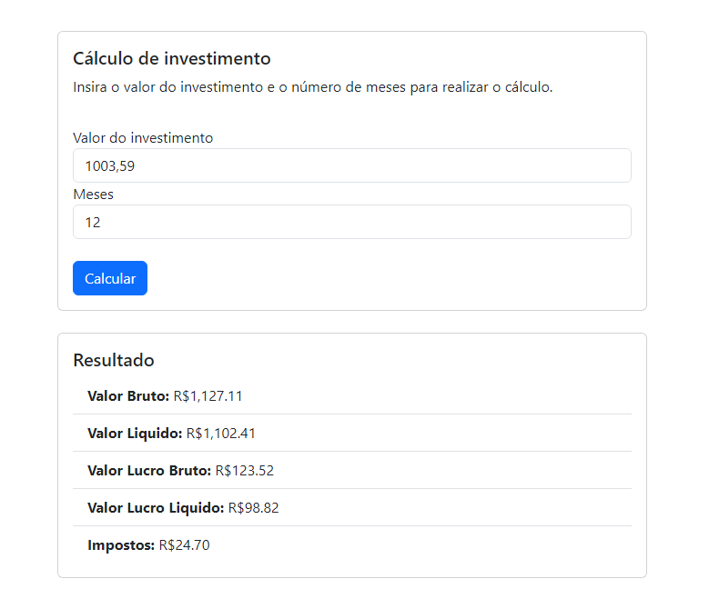
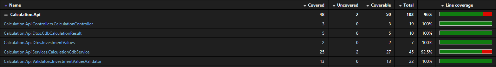

# Solução de cálculo de CDB

Esta solução foi desenvolvida para calcular o CDB. 
No backend foi utilizado `.NET 6.0`, por ser a última versão LTS e `xUnit` para os testes.
O frontend foi desenvolvido com `Angular 16` e `Jasmine` para os testes.



Foram utilizados conceitos de Arquitetura Limpa junto com SOLID, DRY, YAGNI, KISS.

## Executando o backend

Execute o seguinte comando na pasta do projeto:
```sh
dotnet run
```

Execute os testes com o comando:
```sh
dotnet test
```


## Executando o frontend

Execute o seguinte comando na pasta do projeto(dentro da pasta frontend):
```sh
npm start
```

Execute os testes com o comando:
```sh
npm test
```

## Cobertura de teste


